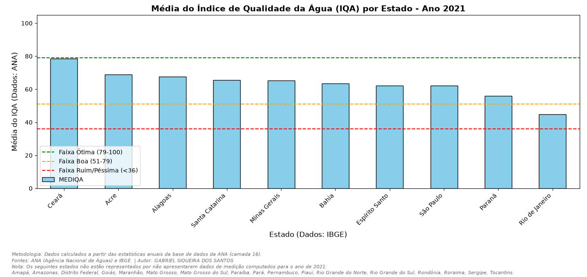

# Análise do Índice da Média da Qualidade da Água

Este projeto em Python extrai dados reais da API da Agência Nacional de Águas e Saneamento e cruza com os dados geográficos da API do IBGE para gerar uma visualização da média da qualidade da água dos estados. Os parâmetros das análises da potabilidade são: Oxigênio Dissolvido, Fósforo Total, Demanda Bioquímica de Oxigênio, Turbidez e E. coli. Foi realizado um recorte temporal para o ano de 2021 para garantir a sincronia e comparabilidade dos dados entre os estados. Os estados que não registraram dados neste ano específico foram listados de forma transparente no rodapé da visualização.

## Confira abaixo o gráfico gerado a partir do cruzamento dos dados da ANA e do IBGE para o ano de 2021:

## Tecnologias Utilizadas

* Python 3
* Pandas (Tratamento e cruzamento de dados)
* Matplotlib (Visualização)
* Requests (Consumo de APIs)
* Pathlib

